# JVM中的GC测试

## 1.参数设置

### 1.堆参数

| 设置                       | 释意                                                         |
| :------------------------- | ------------------------------------------------------------ |
| -Xms                       | 指定堆内存空间的初始大小。 如 -Xms4g。 而且指定的内存大小，并不是操作系统实际分配的初始值,而是GC先规划好,用到才回分配.专用服务器需要保持-Xms和-Xmx一致,否则应用刚启动可能就有好几个FullGC.当两者配置不一致是,堆内存扩容可能会导致系统性能抖动. |
| -Xmx                       | 最大堆大小                                                   |
| -XX:NewSize=n              | 设置年轻代大小,-Xmn, 等价于 -XX:NewSize，使用 G1 垃圾收集器 不应该 设置该选项，在其他的某些业务场景下可以设置.官方建议设置为-Xmx的1/2-1/4 |
| - XX:NewRatio=n            | 默认是2,设置年轻代和老年代的比值,如:为3,表示年轻代与老年代比值为1:3,年轻代占整个年轻代老年代和的1/4 |
| -XX:SurvivorRatio=n        | 默认是8:1,年轻代中Eden区与两个Survivor区的比值.注意Survivor区有两个.如:3,表示Eden:Survivor=3:2,一个Survivor区占整个年轻代的1/5 |
| -XX:MaxPermSize=n          | 设置持久代大小 收集器设置                                    |
| -XX:+UseSerialGC           | 设置串行收集器                                               |
| -XX:+UseParallelGC:        | 设置并行收集器                                               |
| -XX:+UseParalledlOldGC     | 设置并行年老代收集器                                         |
| -XX:+UseConcMarkSweepGC    | 设置并发收集器                                               |
| -XX:MaxPermSize=size       | 设置持久代最大值 , 这是 JDK1.7 之前使用的。Java8 默认允许的Meta空间无限大，此参数无效。 |
| -XX：MaxMetaspaceSize=size | 系统可以使用的最大堆外内存，这个参数跟-Dsun.nio.MaxDirectMemorySize 效果相同。 |
| -Xss                       | 设置每个线程栈的字节数。 例如 -Xss1m 指定线程栈为 1MB，与-XX:ThreadStackSize=1m 等价; JDK5.0以后每个线程堆栈大小为1M,以前每个线程堆栈大小为256K.更具应用的线程所需内存大小进行 调整.在相同物理内存下,减小这个值能生成更多的线程.但是操作系统对一个进程内的线程数还是有限制的,不能无限生成,经验值在3000~5000左右 一般小的应用， 如果栈不是很深， 应该是128k够用的 大的应用建议使用256k。这个选项对性能影响比较大，需要严格的测试。（校长） 和threadstacksize选项解释很类似,官方文档似乎没有解释,在论坛中有这样一句话:"” -Xss is translated in a VM flag named ThreadStackSize” 一般设置这个值就可以了。 |
|                            |                                                              |

### 2. 垃圾收集器参数

#### 1.垃圾收集器设置

| 设置                    | 释意                 |
| ----------------------- | -------------------- |
| -XX:+UseSerialGC        | 设置串行收集器       |
| -XX:+UseParallelGC      | 设置并行收集器       |
| -XX:+UseParalledlOldGC  | 设置并行年老代收集器 |
| -XX:+UseConcMarkSweepGC | 设置并发收集器       |

#### 2.垃圾回收统计信息

| 设置                   | 释意               |
| ---------------------- | ------------------ |
| -XX:+PrintGC           | 垃圾收集器打印     |
| -XX:+PrintGCDetails    | 垃圾收集器详情打印 |
| -XX:+PrintGCTimeStamps |                    |
| -Xloggc:filename       |                    |

#### 3.并行收集器设置

| 设置                    | 释意                                                 |
| ----------------------- | ---------------------------------------------------- |
| -XX:ParallelGCThreads=n | 设置并行收集器收集时使用的CPU数.并行收集线程数       |
| -XX:MaxGCPauseMillis=n  | 设置并行收集最大暂停时间                             |
| -XX:GCTimeRatio=n       | 设置垃圾回收时间占程序运行时间的百分比.公式为1/(1+n) |

#### 4.并发收集器设置

| 设置                    | 释意                                                         |
| ----------------------- | ------------------------------------------------------------ |
| -XX:+CMSIncrementalMode | 设置为增量模式.适用于单CPU情况                               |
| -XX:ParallelGCThreads=n | 设置并发收集器年轻代收集方式为并行收集时,使用的CPU数.并行收集线程数. |

## 2.JVM内存结构

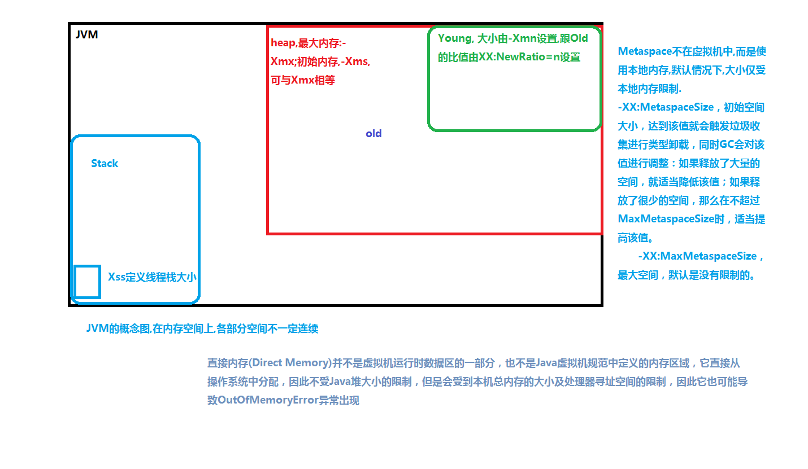

##  3.测试与验证

###  3.1.测试代码

```java

import java.util.Random;
import java.util.concurrent.TimeUnit;
import java.util.concurrent.atomic.LongAdder;
/*
演示GC日志生成与解读
*/
public class GCLogAnalysis {
    private static Random random = new Random();
    public static void main(String[] args) {
        // 当前毫秒时间戳
        long startMillis = System.currentTimeMillis();
        // 持续运行毫秒数; 可根据需要进行修改
        long timeoutMillis = TimeUnit.SECONDS.toMillis(1);
        // 结束时间戳
        long endMillis = startMillis + timeoutMillis;
        LongAdder counter = new LongAdder();
        System.out.println("正在执行...");
        // 缓存一部分对象; 进入老年代
        int cacheSize = 2000;
        Object[] cachedGarbage = new Object[cacheSize];
        // 在此时间范围内,持续循环
        while (System.currentTimeMillis() < endMillis) {
            // 生成垃圾对象
            Object garbage = generateGarbage(100*1024);
            counter.increment();
            int randomIndex = random.nextInt(2 * cacheSize);
            if (randomIndex < cacheSize) {
                cachedGarbage[randomIndex] = garbage;
            }
        }
        System.out.println("执行结束!共生成对象次数:" + counter.longValue());
    }

    // 生成对象
    private static Object generateGarbage(int max) {
        int randomSize = random.nextInt(max);
        int type = randomSize % 4;
        Object result = null;
        switch (type) {
            case 0:
                result = new int[randomSize];
                break;
            case 1:
                result = new byte[randomSize];
                break;
            case 2:
                result = new double[randomSize];
                break;
            default:
                StringBuilder builder = new StringBuilder();
                String randomString = "randomString-Anything";
                while (builder.length() < randomSize) {
                    builder.append(randomString);
                    builder.append(max);
                    builder.append(randomSize);
                }
                result = builder.toString();
                break;
        }
        return result;
    }
}
```

### 3.2.测试系统配置

16G内存+i7+4核

根据代码可知,代码执行总时间为1s

### 3.3.测试JVM的参数

| GC         | 配置                                                         |
| ---------- | ------------------------------------------------------------ |
| SerialGC   | java -XX:+UseSerialGC -Xms512m -Xmx512m   -Xloggc:gc.demo.log   -XX:+PrintGCDetails  -XX:+PrintGCDateStamps  GCLogAnalysis |
| ParallelGC | java -XX:+UseParallelGC  ...                                 |
| CMS        | java -XX:+UseConcMarkSweepGC                                 |
| G1         | java -XX:+UseG1GC                                            |

关于最大内存/初始内存,也作为变量,做参考

###  3.4 测试开始

#### 3.4.1 4核,默认年轻代大小,比例 

##### 3.4.1.1 Xmx256m -Xms256m

| GC         | Test success times | Total GC count   | Total GC time | Avg GC time | GC min/max time | Minor GC total time | Minor GC avg time | Minor GC count | Full GC total time | Full GC avg time | Full GC Count | Avg creation rate | Avg promotion rate |
| ---------- | ------------------ | ---------------- | ------------- | ----------- | --------------- | ------------------- | ----------------- | -------------- | ------------------ | ---------------- | ------------- | ----------------- | ------------------ |
| SerialGC   |                    | OutOfMemoryError |               |             |                 |                     |                   |                |                    |                  |               |                   |                    |
| ParallelGC |                    | OutOfMemoryError |               |             |                 |                     |                   |                |                    |                  |               |                   |                    |
| CMS        | 4679               |                  | 830ms         |             |                 | 380ms               | 21.1ms            |                | 400ms              | 28.6ms           | 14            | 1.14gb/sec        | 178.88mb/sec       |
| G1         |                    | OutOfMemoryError |               |             |                 |                     |                   |                |                    |                  |               |                   |                    |

CMS

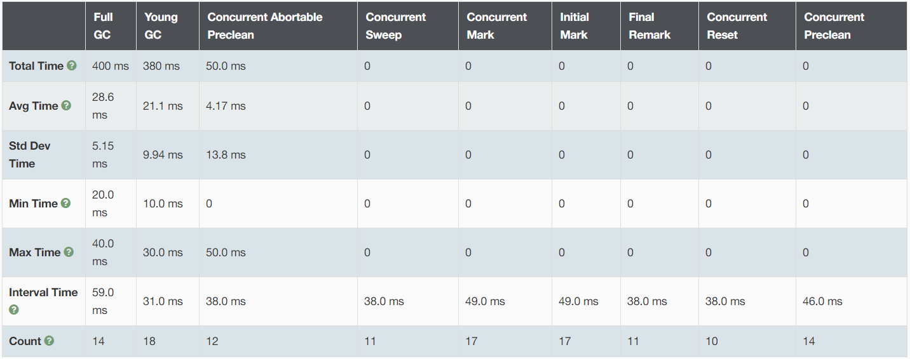

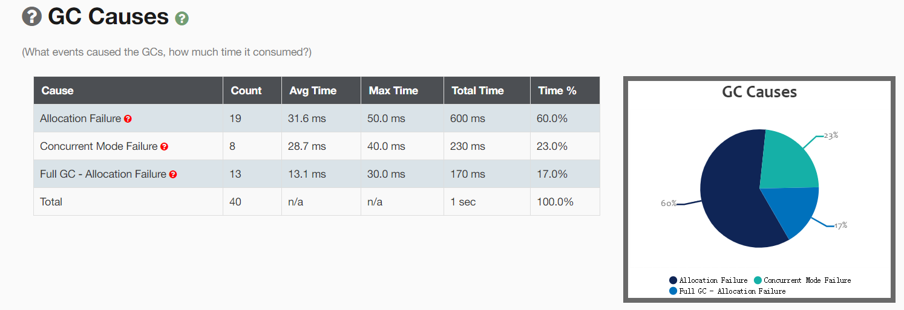

##### 3.4.1.2 Xmx512m -Xms512m

| GC         | Test success times | Total GC count | Total GC time | Avg GC time | GC min/max time | Minor GC total time | Minor GC avg time | Minor GC count | Full GC total time | Full GC avg time | Full GC Count | Avg creation rate | Avg promotion rate |
| ---------- | ------------------ | -------------- | ------------- | ----------- | --------------- | ------------------- | ----------------- | -------------- | ------------------ | ---------------- | ------------- | ----------------- | ------------------ |
| SerialGC   | 11195              | 21             | 590ms         | 28.1ms      | 10.0ms/50.0ms   | 200ms               | 18.2 ms           | 11             | 390 ms             | 39.0ms           | 10            | 3.12gb/sec        | 453.11mb/sec       |
| ParallelGC | 8812               | 35             | 610ms         | 17.4ms      | 0/50.0ms        | 230ms               | 9.20 ms           | 25             | 380 ms             | 38.0ms           | 10            | 2.3 gb/sec        | 536.68mb/sec       |
| CMS        | 10604              |                | 710ms         |             | 0/50.0ms        | 450ms               | 25.0 ms           | 18             | 50.0ms             | 50.0ms           | 1             | 2.61gb/sec        | 652.79mb/sec       |
| G1         | 10766              | 187            | 239ms         | 1.28ms      | 0/30.0ms        | 30.0                | 0.811ms           | 37             |                    |                  |               | 2.99gb/sec        | 473.72mb/sec       |

CMS

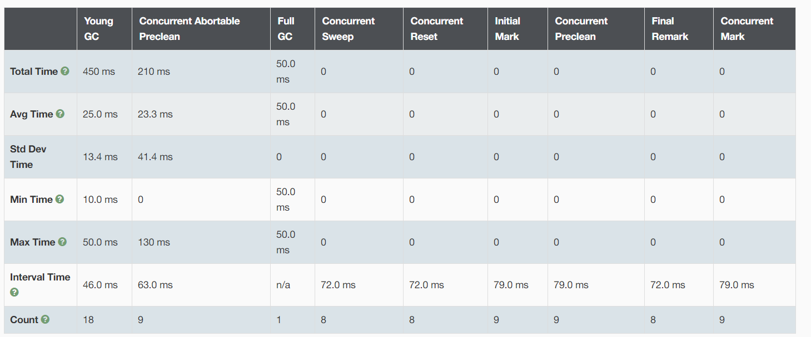

G1

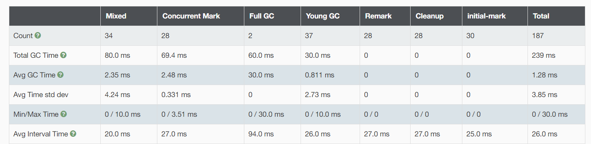

##### 3.4.1.3 Xmx1g -Xms1g

| GC         | Test success times | Total GC count | Total GC time | Avg GC time | GC min/max time | Minor GC total time | Minor GC avg time | Minor GC count | Full GC total time | Full GC avg time | Full GC Count | Avg creation rate | Avg promotion rate |
| ---------- | ------------------ | -------------- | ------------- | ----------- | --------------- | ------------------- | ----------------- | -------------- | ------------------ | ---------------- | ------------- | ----------------- | ------------------ |
| SerialGC   | 13782              | 13             | 460ms         | 35.4ms      | 10.0ms/50.0ms   | 410ms               | 34.2ms            | 12             | 50ms               | 50ms             | 1             | 4gb/sec           | 1.02 gb/sec        |
| ParallelGC | 13051              | 24             | 460ms         | 19.2ms      | 0/60.0ms        | 350ms               | 15.9ms            | 22             | 110ms              | 55.0ms           | 2             | 4.04gb/sec        | 1.07 gb/sec        |
| CMS        | 13695              | 15             | 750ms         | 50ms        | 10ms/290ms      | 370ms               | 30.8ms            | 12             | 50.0ms             | 50.0ms           | 1             | 3.17gb/sec        | 991.87mb/sec       |
| G1         | 13586              | 30             | 300ms         | 10ms        | 0/30.0ms        | 210ms               | 12.4ms            | 17             |                    |                  |               | 3.88gb/sec        | 208.29mb/sec       |

CMS:

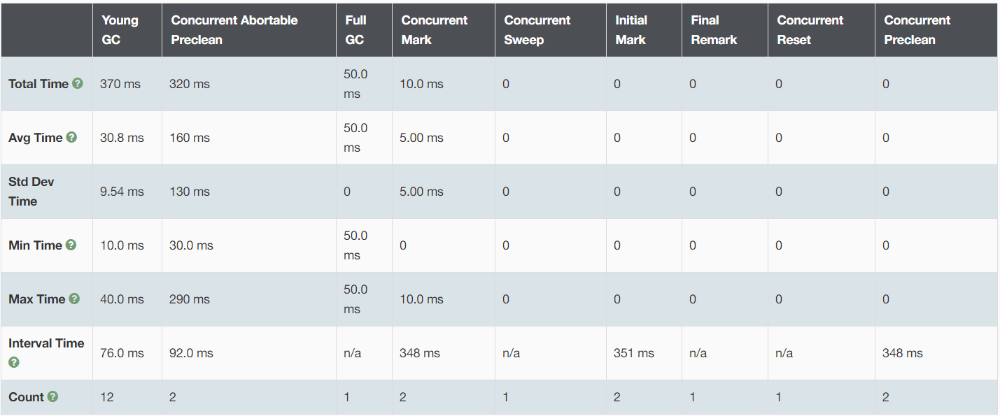

G1

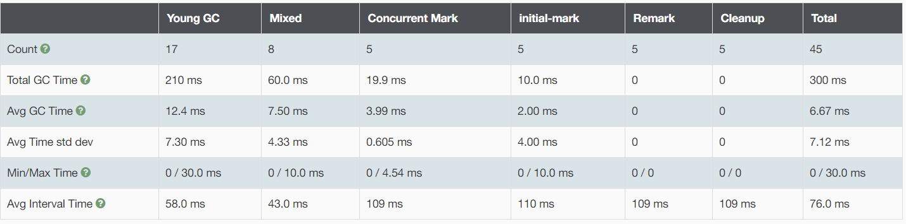

##### 3.4.1.4 Xmx2g -Xms2g

| GC         | Test success times | Total GC count | Total GC time | Avg GC time | GC min/max time | Minor GC total time | Minor GC avg time | Minor GC count | Full GC total time | Full GC avg time | Full GC Count | Avg creation rate | Avg promotion rate |
| ---------- | ------------------ | -------------- | ------------- | ----------- | --------------- | ------------------- | ----------------- | -------------- | ------------------ | ---------------- | ------------- | ----------------- | ------------------ |
| SerialGC   | 12674              | 6              | 380ms         | 63.3ms      |                 | 380ms               | 63.3ms            | 6              |                    |                  |               | 4.6 gb/sec        | 1 gb/sec           |
| ParallelGC | 14032              | 8              | 330ms         | 41.3ms      | 20ms/60ms       | 330ms               | 41.3ms            | 8              |                    |                  |               | 4.63gb/sec        | 832.31mb/sec       |
| CMS        | 12339              | 12             | 460ms         | 38.3ms      | 30ms/40ms       | 460ms               | 38.3ms            | 12             |                    |                  |               | 3.46gb/sec        | 998.03mb/sec       |
| G1         | 14563              | 16             | 265ms         | 16.5ms      | 0 / 30.0 ms     | 240ms               | 16.0ms            | 15             |                    |                  |               | 4.13gb/sec        | 149.94mb/sec       |

CMS:

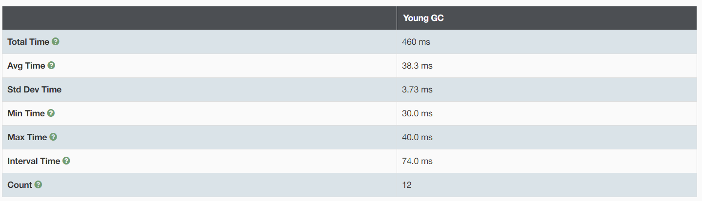

G1:

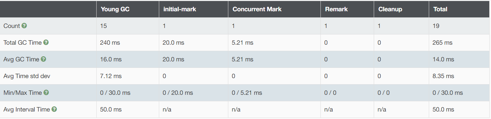

#####  3.4.1.5 Xmx4g -Xms4g

| GC         | Test success times | Total GC count | Total GC time | Avg GC time | GC min/max time | Minor GC total time | Minor GC avg time | Minor GC count | Avg creation rate | Avg promotion rate | Full GC total time | Full GC avg time | Full GC Count |
| ---------- | ------------------ | -------------- | ------------- | ----------- | --------------- | ------------------- | ----------------- | -------------- | ----------------- | ------------------ | ------------------ | ---------------- | ------------- |
| SerialGC   | 12321              | 2              | 200ms         | 100ms       | 90.0ms/110ms    | 200ms               | 100ms             | 2              | 8.53gb/sec        | 1,004.84mb/sec     |                    |                  |               |
| ParallelGC | 12180              | 3              | 240ms         | 80ms        | 70ms/90ms       | 240ms               | 80ms              | 3              | 6.61gb/sec        | 685.34 mb/sec      |                    |                  |               |
| CMS        | 11509              | 11             | 480ms         | 43.6ms      | 40.0ms/50.0ms   | 480ms               | 43.6ms            | 11             | 3.49gb/sec        | 1,001.91mb/sec     |                    |                  |               |
| G1         | 13287              | 15             | 380ms         | 25.3ms      | 20ms/50ms       | 380ms               | 25.3ms            | 15             | 4.02gb/sec        | 1.26 gb/sec        |                    |                  |               |

值的注意的是,

- CMS,没有触发CMS标记垃圾清理,只有ParNewGC
- G1,没有触发G1标记阶段的特色垃圾清理,只有Parallel???????

##### 3.4.1.6 Xmx8g -Xms8g

| GC         | Test success times | Total GC count | Total GC time | Avg GC time | GC min/max time | Minor GC total time | Minor GC avg time | Minor GC count | Full GC total time | Full GC avg time | Full GC Count | Avg creation rate | Avg promotion rate |
| ---------- | ------------------ | -------------- | ------------- | ----------- | --------------- | ------------------- | ----------------- | -------------- | ------------------ | ---------------- | ------------- | ----------------- | ------------------ |
| SerialGC   | 8346               | 1              | 130ms         | 130ms       | 130ms/130ms     | 130ms               | 130ms             | 1              |                    |                  |               | /                 | /                  |
| ParallelGC | 7901               | 1              | 100ms         | 100ms       | 100ms/100ms     | 100ms               | 100ms             | 1              |                    |                  |               | /                 | /                  |
| CMS        | 9387               | 9              | 610ms         | 67.8ms      | 60ms/70ms       | 610ms               | 67.8ms            | 9              |                    |                  |               | 2.83gb/sec        | 831.77mb/sec       |
| G1         | 14545              | 10             | 330ms         | 33.0ms      | 30ms/40ms       | 330ms               | 33ms              | 10             |                    |                  |               | 4.75gb/sec        | 1.46 gb/sec        |

值的注意的是,

- CMS,没有触发CMS标记垃圾清理,只有ParNewGC
- G1,没有触发G1标记阶段的特色垃圾清理,只有Parallel???????

#### 结论1:

1. 对内存比较大的时候,G1比较适合
2. 高吞吐的是并行GC
3. GC频繁，增加堆内存，可以降低这一频率

####  3.4.2 4核,增加年轻代大小,其他比例默认

​	测试代码上可以看出都是不停的额新建对象,所以预估增加年轻代大小有利于提升性能

​	观看上面的测试结果,增加年轻代大小由两种方式,一种是增加年轻代的比例,一是增加堆,增加堆的上面的测试就是,就不测了,我们就增加年轻代比例.

提升性能,提升年轻代预估结果:

- 由于年轻代大小提升,minorGC会减少,但是单次minorGC时间会增加
- 观察下FullGC的情况,如果老年代比较小,FullGC的评率会提升

1g的堆出现了fullGC就用这个看

##### 3.4.2.1 Xmx1g -Xms1g

| GC         | Test success times | Total GC count | Total GC time | Avg GC time | GC min/max time | Minor GC total time | Minor GC avg time | Minor GC count | Full GC total time | Full GC avg time | Full GC Count | Avg creation rate | Avg promotion rate |
| ---------- | ------------------ | -------------- | ------------- | ----------- | --------------- | ------------------- | ----------------- | -------------- | ------------------ | ---------------- | ------------- | ----------------- | ------------------ |
| SerialGC   | 14517              | 9              | 380ms         | 42.2ms      | 20ms/60ms       | 290ms               | 41.4ms            | 7              | 90ms               | 45ms             | 2             | 4.57gb/sec        | 775.39mb/sec       |
| ParallelGC | 12520              | 15             | 440ms         | 29.3ms      | 10ms/50ms       | 300ms               | 25ms              | 12             | 140ms              | 46.7ms           | 3             | 4.02gb/sec        | 773.59mb/sec       |
| CMS        | 13743              | 8              | 560ms         | 70ms        | 20ms/190ms      | 280ms               | 40ms              | 7              | 80ms               | 80ms             | 1             | 4.11gb/sec        | 835.41mb/sec       |
| G1         | 13599              | 15             | 165ms         | 11ms        | 0/40ms          | 60ms                | 6.67ms            | 9              | 80ms               | 40ms             | 2             | 5.06gb/sec        | 1.35 gb/sec        |

CMS:

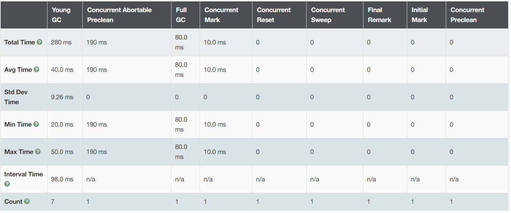

G1:

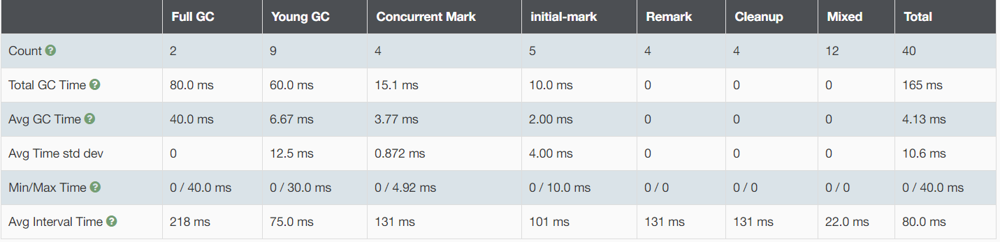

##### 3.4.2.2 Xmx2g -Xms2g

| GC         | Test success times | Total GC count | Total GC time | Avg GC time | GC min/max time | Minor GC total time | Minor GC avg time | Minor GC count | Full GC total time | Full GC avg time | Full GC Count | Avg creation rate | Avg promotion rate |
| ---------- | ------------------ | -------------- | ------------- | ----------- | --------------- | ------------------- | ----------------- | -------------- | ------------------ | ---------------- | ------------- | ----------------- | ------------------ |
| SerialGC   | 12614              | 4              | 310ms         | 77.5ms      | 70ms/90ms       | 310ms               | 77.5ms            | 4              |                    |                  |               | 5.48 /sec         | 883.64mb/sec       |
| ParallelGC | 14885              | 5              | 300ms         | 60ms        | 50ms/80ms       | 300ms               | 60ms              | 5              |                    |                  |               | 5.73gb/sec        | 881.21mb/sec       |
| CMS        | 12578              | 4              | 290ms         | 72.5ms      | 60ms/80ms       | 290ms               | 72.5ms            | 4              |                    |                  |               | 5.17gb/sec        | 834.39mb/sec       |
| G1         | 12309              | 2              | 100ms         | 50ms        | 40ms/60ms       |                     |                   |                |                    |                  |               | 9.29gb/sec        |                    |

CMS:

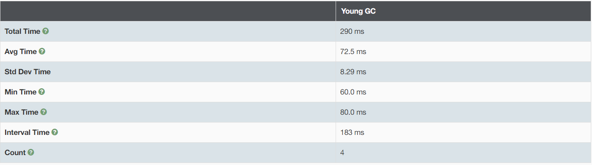

G1:

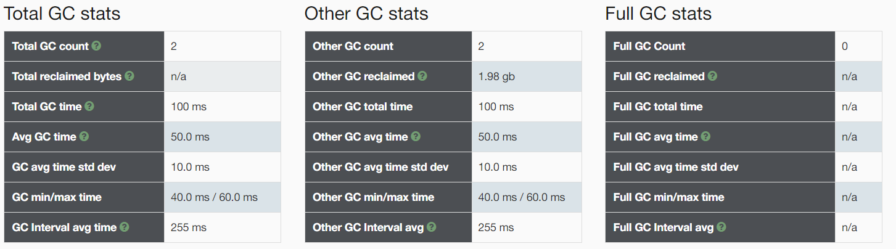

#####  结论2:

- 年轻代大小增加,该测试代码中,性能没有极大提升
- 吞吐量提升了(GC时间占比少了)
- FullGC的相对频率上升了(FullGC次数/总GC的次数)

####  3.4.3 2核,默认年轻代,比例

#####  3.4.3.1 -Xmx1g -Xms1g

| GC         | Test success times | Total GC count | Total GC time | Avg GC time | GC min/max time | Minor GC total time | Minor GC avg time | Minor GC count | Full GC total time | Full GC avg time | Full GC Count | Avg creation rate | Avg promotion rate |
| ---------- | ------------------ | -------------- | ------------- | ----------- | --------------- | ------------------- | ----------------- | -------------- | ------------------ | ---------------- | ------------- | ----------------- | ------------------ |
| SerialGC   | 10860              | 10             | 480ms         | 48.0ms      | 10ms/70ms       | 430ms               | 47.8ms            | 9              | 50ms               | 50ms             | 1             | 3.36gb/sec        | 827.82mb/sec       |
| ParallelGC | 13389              | 25             | 410ms         | 16.4ms      | 0/50ms          | 320ms               | 13.9ms            | 23             | 90ms               | 45ms             | 2             | 4.12gb/sec        | 1.07 gb/sec        |
| CMS        | 11863              | 13             | 790ms         | 60.76ms     |                 | 450ms               | 40.9ms            | 11             |                    |                  |               | 3.14gb/sec        | 1,018.59mb/sec     |
| G1         | 12940              | 31             | 267ms         | 8.6ms       | 0/20ms          | 170ms               | 11.3ms            | 15             |                    |                  |               | 3.77gb/sec        | 384.15 mb/sec      |

CMS:


G1:


##### 3.4.3.2 -Xmx2g -Xms2g

| GC         | Test success times | Total GC count | Total GC time | Avg GC time | GC min/max time | Minor GC total time | Minor GC avg time | Minor GC count | Full GC total time | Full GC avg time | Full GC Count | Avg creation rate | Avg promotion rate |
| ---------- | ------------------ | -------------- | ------------- | ----------- | --------------- | ------------------- | ----------------- | -------------- | ------------------ | ---------------- | ------------- | ----------------- | ------------------ |
| SerialGC   | 10529              | 5              | 430ms         | 86ms        | 80ms/110ms      | 430ms               | 86ms              | 5              |                    |                  |               | 4.21gb/sec        | 877.72mb/sec       |
| ParallelGC | 12730              | 6              | 260ms         | 43.3ms      | 40ms/50ms       | 260ms               | 43.03ms           | 6              |                    |                  |               | 5.22gb/sec        | 1.03 gb/sec        |
| CMS        | 9446               | 9              | 460ms         | 51.1ms      | 30ms/60ms       | 460ms               | 51.1ms            | 9              |                    |                  |               | 3.17gb/sec        | 893.26mb/sec       |
| G1         | 9433               | 13             | 170ms         | 13.1ms      | 10ms/30ms       | 170ms               | 13.1ms            | 13             |                    |                  |               | 2.95gb/sec        | 123.92mb/sec       |


######  结论3:

- cms/G1对cpu的资源比较敏感,相较于串行与并行GC,其占用cpu比较多,cpu核数少,尽量避免使用cms/G1

  ​


###  总的感受

- 一般而言,GC的选择对性能有一定积极作用,但是,没有最好的GC,只有相对项目,服务器最适合的
- 服务器的性能对服务性能很大,选择GC时需要考虑服务器的配置
- 相对而言,并行的GC吞吐量教高,但是GC的STW比较高,响应速度会有影响
- CMS以及G1特别在老年代的处理时,将GC分阶段,只有一小部分STW,所以其响应速度较高,但是吞吐相对的会高点,但是不是太多
- CPU核数少时,CMS尽量不用,因为CMS的CPU的线程占用率高,会拖慢服务性能
- 堆内存比较大的时候，使用G1，是比较好的选择
- GC回收器的选择需要结合实际的项目,服务配置,测试结果综合考虑


